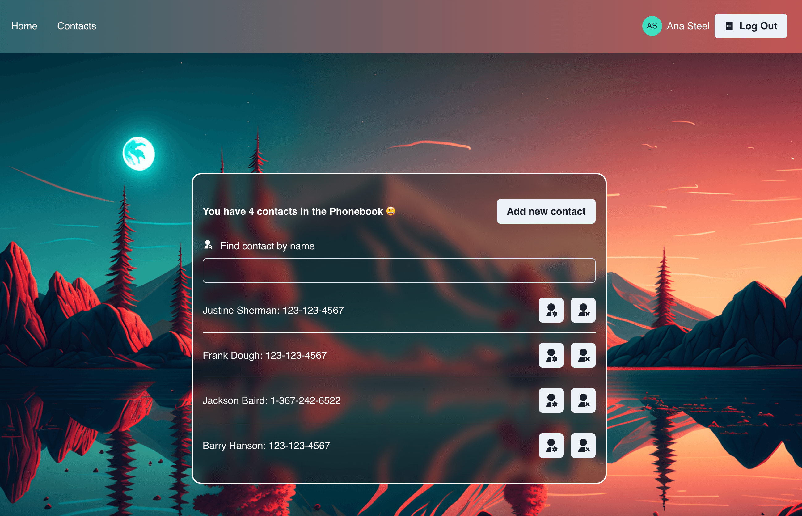
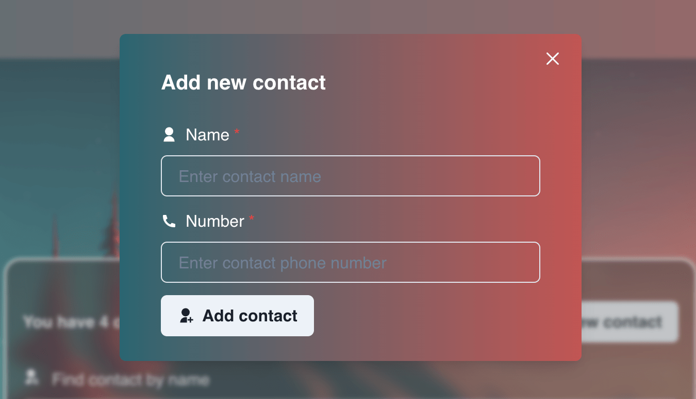
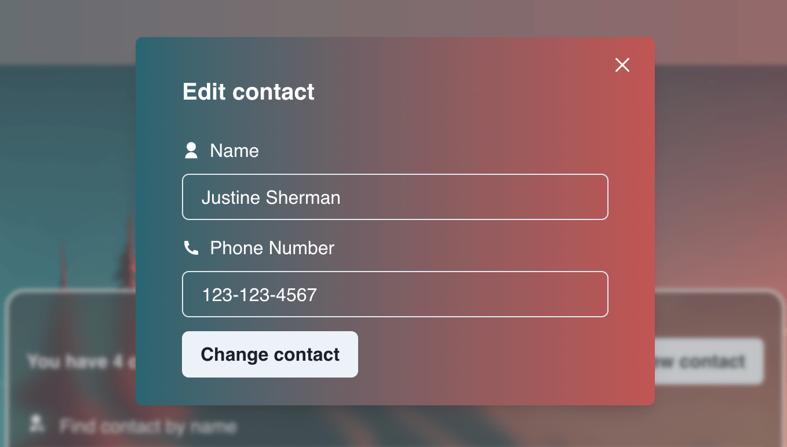
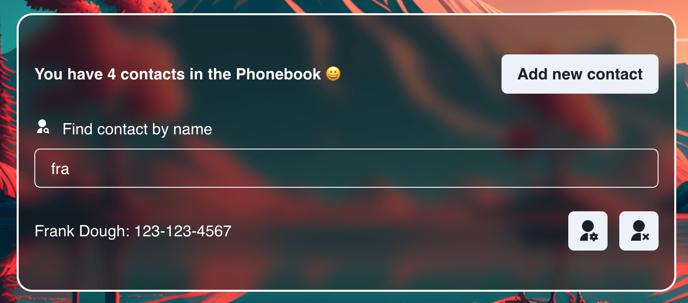

# Phonebook App

Phonebook is a convenient and user-friendly application for organizing a personal contact list. 

Users can register, log in, add contacts, edit contact details, delete contacts, and search contacts by name.




## Features

### User Registration and Authentication

Users can create an account and log in to access their personal phonebook.

### Contact Management

Users can manage their contacts with full CRUD functionality:

- **Add contacts** — create new contacts with a name and phone number.
- **Edit contacts** — update existing contact details.
- **Delete contacts** — remove contacts from the phonebook.
- **Search contacts** — quickly find contacts by name.







## Technologies Used

- React
- JavaScript
- Redux Toolkit
- React Redux
- React Router DOM
- Axios
- Chakra UI
- Formik
- Yup
- Redux Persist
- React Hot Toast
- Vite

## Installation

Clone the repository:

```
git clone https://github.com/sandra-selezen/phonebook-app.git
```

Install dependencies:

```
npm install
```

Start the development server:

```
npm run dev
```

## Project Status

This project was created during my learning journey.
