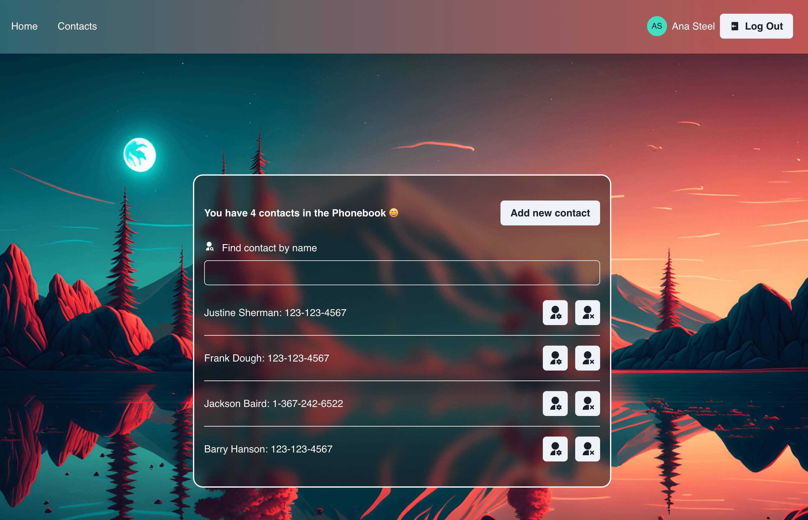
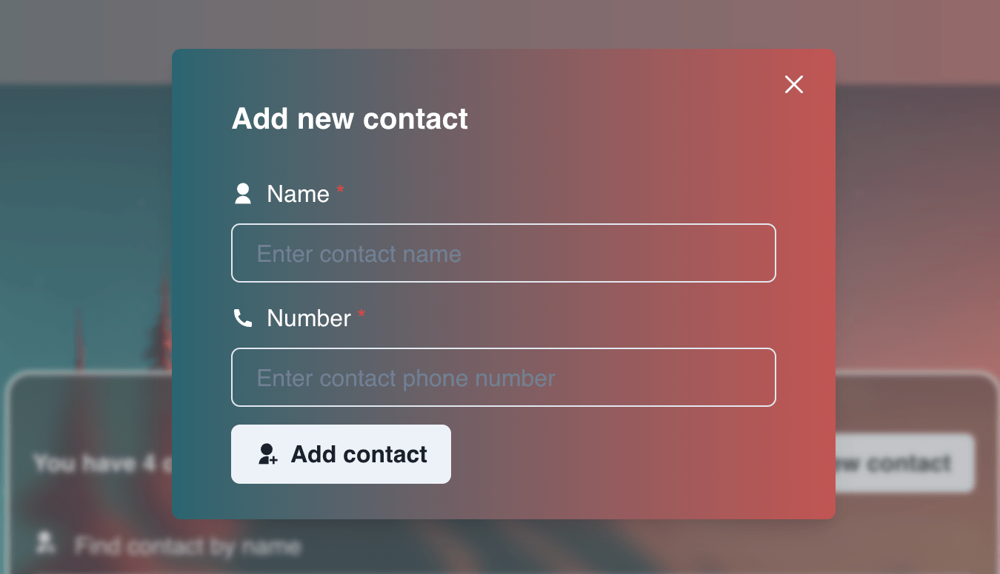
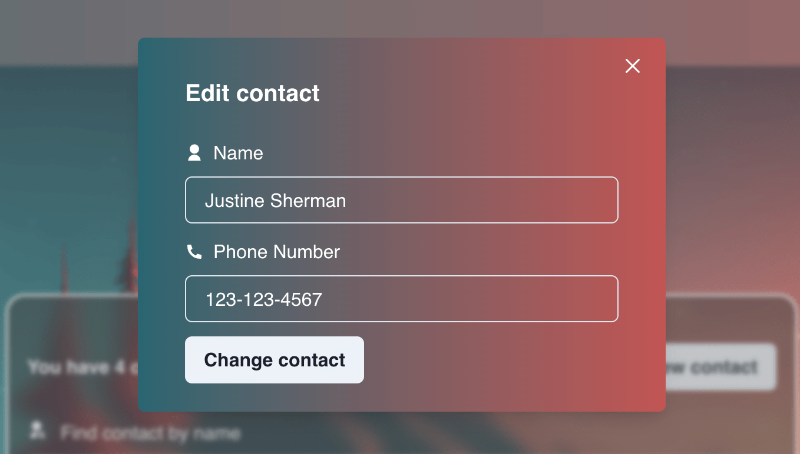
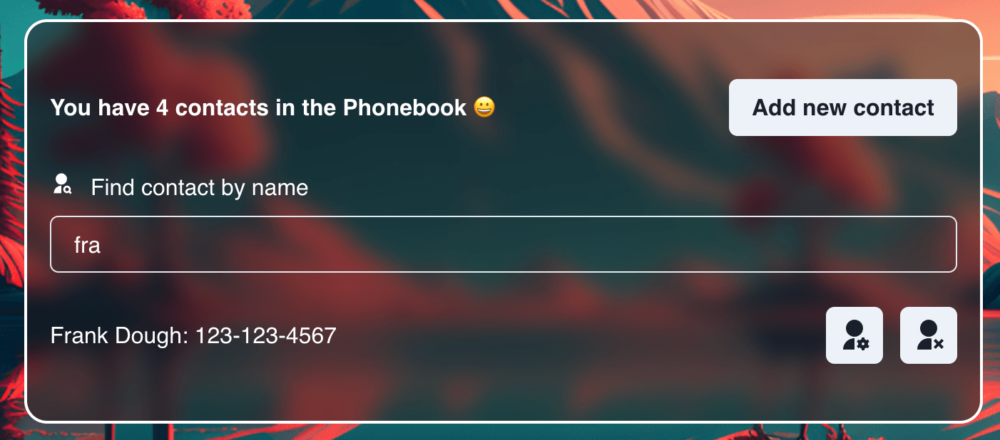

# Phonebook App

Phonebook is a convenient and user-friendly application designed to organize
personal phonebook.

## Features
1. **User Registration and Authentication:** Users can register an account and authenticate themselves to access their personal phonebook.

2. **Contact Management:**
- **Add Contacts:** Users can add new contacts to their phonebook, including details such as name and phone number.

- **Edit Contacts:** Contacts in the phonebook can be edited to update or correct contact information.

- **Delete Contacts:** Users can remove contacts from their phonebook.
- **Contact Search:** Users can search for contacts by name, making it easy to find specific contacts within the phonebook.

## Technologies Used
- JavaScript
- React
- Redux
- CRUD (Create, Read, Update, Delete)
- Chakra UI for user interface components
- Formik + Yup for form management and validation
